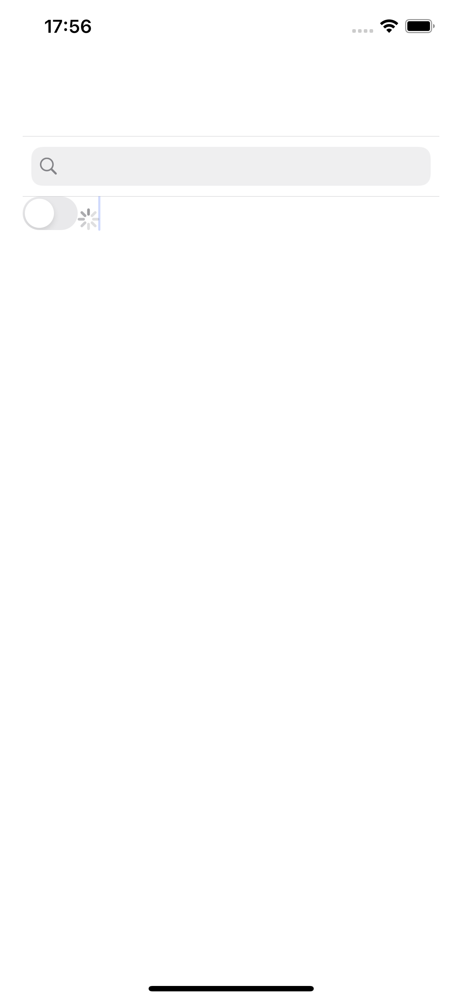

# ViewAttachment

## Install

To install ViewAttachement, you need to use `Swift Package Manager`

## Usage

```swift
class ViewController: UIViewController {

    override func viewDidLoad() {
        super.viewDidLoad()
        let search = UISearchBar(frame: .zero)
        search.translatesAutoresizingMaskIntoConstraints = false
        let attach = ViewAttachment(attachedView: search)
        let textView = ViewAttachmentTextView(frame: .zero)
        textView.translatesAutoresizingMaskIntoConstraints = false
        textView.backgroundColor = .yellow
        textView.textContainerInset = .init(top: 6, left: 16, bottom: 6, right: 16);
        textView.insert(viewAttachment: attach)
        let switchd = UISwitch(frame: .zero)
        switchd.translatesAutoresizingMaskIntoConstraints = false
        textView.insert(viewAttachment: ViewAttachment(attachedView: switchd))
        let activity = UIActivityIndicatorView(style: .medium)
        activity.translatesAutoresizingMaskIntoConstraints = false
        activity.startAnimating()
        textView.insert(viewAttachment: ViewAttachment(attachedView: activity))

        view.addSubview(textView)

        NSLayoutConstraint.activate([
            textView.topAnchor.constraint(equalTo: view.topAnchor, constant: 120),
            textView.bottomAnchor.constraint(equalTo: view.bottomAnchor),
            textView.leadingAnchor.constraint(equalTo: view.leadingAnchor),
            textView.trailingAnchor.constraint(equalTo: view.trailingAnchor),
        ])
    }
}
```

## Example


